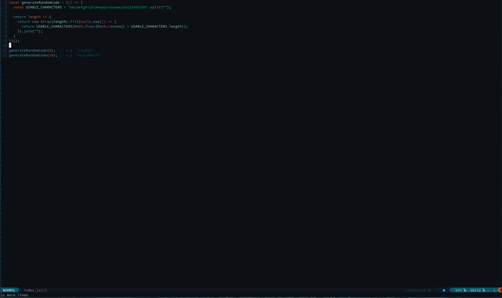
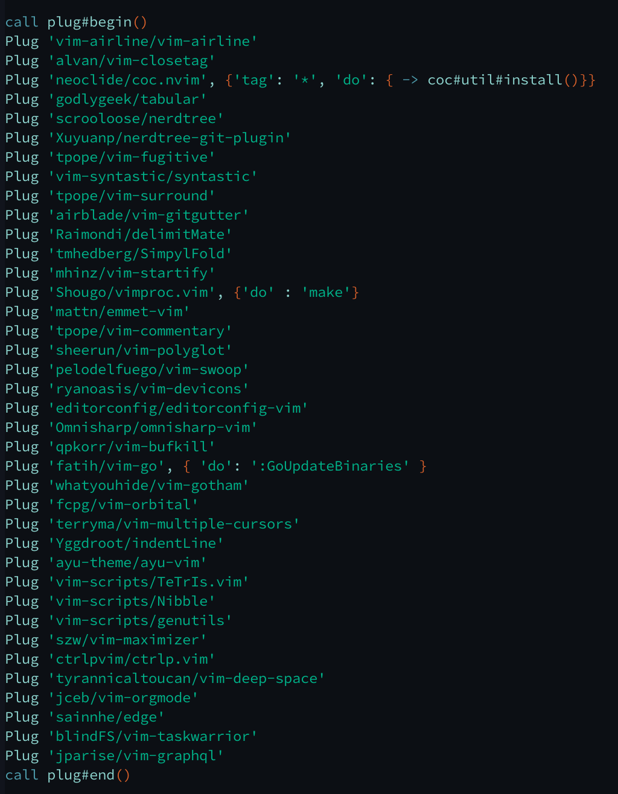
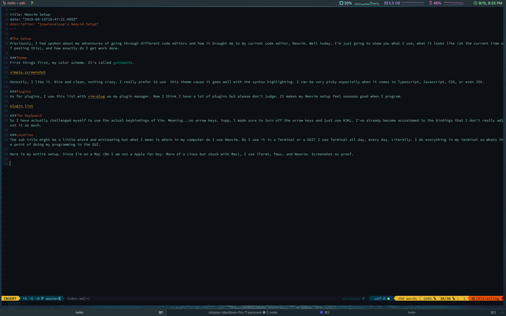

#The Setup
Previously, I had spoken about my adventures of going through different code editors and how it brought me to my current code editor, Neovim. Well today, I'm just going to show you what I use, what it looks like (at the current time of posting this), and how exactly do I get work done. 

###Theme
First things first, my color scheme. It's called `gotham256`.

Honestly, I like it. Nice and clean, nothing crazy. I really prefer to use  this theme cause it goes well with the syntax highlighting. I can be very picky especially when it comes to Typescript, Javascript, CSS, or even JSX. 

###Plugins
As for plugins, I use this list with [vim-plug](https://github.com/junegunn/vim-plug) as my plugin manager. Now I think I have a lot of plugins but please don't judge. It makes my Neovim setup feel soooooo good when I program. 

###The Keyboard
So I have actually challenged myself to use the actual keybindings of Vim. Meaning...no arrow keys. Yupp, I made sure to turn off the arrow keys and just use HJKL. I've already become accustomed to the bindings that I don't really adjust it as much. 

###Location
The sub title might be a little wierd and misleading but what I mean is where in my computer do I use Neovim. Do I use it in a Terminal or a GUI? I use Terminal all day, every day. Literally. I do everything in my terminal so whats the point of doing my programming in the GUI. 

Here is my entire setup. Since I'm on a Mac (No I am not a Apple fan boy. More of a Linux but stuck with Mac), I use iTerm2, Tmux, and Neovim. Screenshot as proof. 

So yeah, this is my neovim editor setup. If you want a setup similar to mine, here is a link to my [init.vim](https://gist.github.com/joselevelsup/7907041b4f7c07dc74a02bca925a5b0c)

